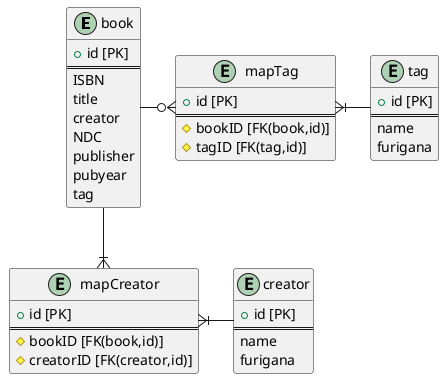

# DB 設計

## ER 図

```puml
@startuml
entity "book" {
    +id [PK]
    ==
    ISBN
    title
    creator
    NDC
    publisher
    pubyear
    tag
}

entity "creator" {
    +id [PK]
    ==
    name
    furigana
}

entity "tag"{
    +id [PK]
    ==
    name
    furigana
}

entity "mapCreator" {
    +id [PK]
    ==
    #bookID [FK(book,id)]
    #creatorID [FK(creator,id)]
}

entity "mapTag"{
    +id [PK]
    ==
    #bookID [FK(book,id)]
    #tagID [FK(tag,id)]
}

book --|{ mapCreator
book -o{ mapTag
mapCreator }|- creator
mapTag }|- tag

@enduml
```
