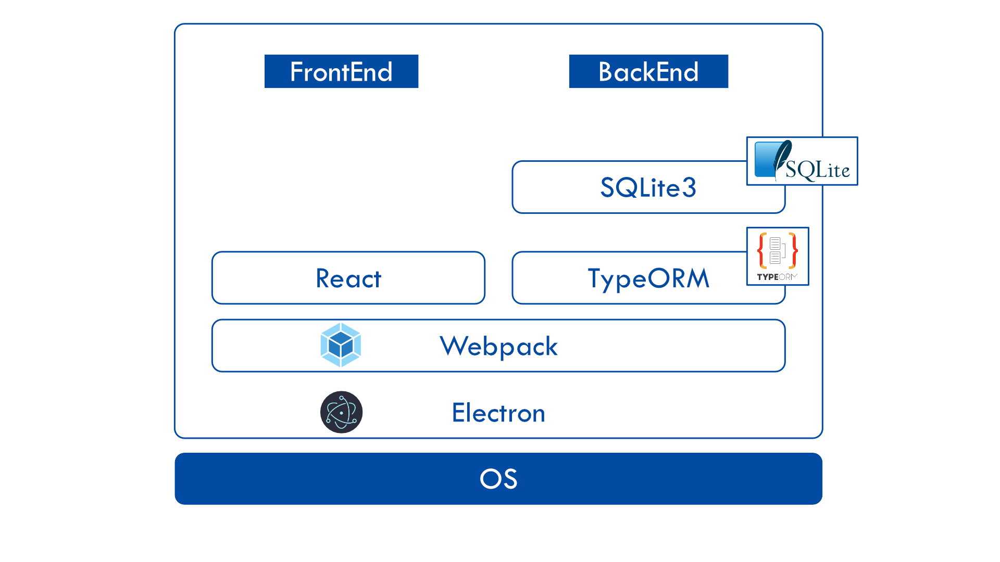

# 小規模図書管理システム HomeLib（仮）

自宅や文芸系の部室、研究室などで使える小規模な図書管理システム

## 要件

- 基本的な図書管理（検索等）
- 図書登録には ISBN を使用。図書情報は ISBN を使って国会図書館などのデータベースから取得する
- ISBN が付与されていない書籍（ISBN 普及前の書籍や、海外の書籍、同人誌など）については、独自の ID を発行し、バーコードとして出力する
- 簡単なユーザー管理と貸与管理。ユーザーの登録には、任意の ID を使用することができる。（例：学生証など）。ユーザーに新しい ID を認識させる必要がないようにする。

## 技術的仕様

基本的に PC 上で実行するソフトウェアとして開発する。  

- Electron：クロスプラットフォームなデスクトップアプリケーションエンジン。HTML/CSS/JS を始めとした WEB 技術を用いてデスクトップアプリケーションを制作することができる。  
  https://www.electronjs.org

- Webpack：モジュールバンドラ。基本的には、Javascript などのファイルを一つにまとめるて TTP リクエストを減らすことで、Web サイトの高速化を図るもの。その段階で、JS の minify や最適化等を行ってくれるため、HTTP リクエスト等が関係ない今回も導入する。  
  https://webpack.js.org

- React：View 管理のための Javascript ライブラリ。View を効率的に管理することができる。  
  https://ja.reactjs.org

- TypeScript：AltJS の一つ。Javascript は基本的に動的型付けな言語なのだが、Typescript は静的型付けを導入することができる。また、interface や class などの機能を使うこともできる。また、型が厳密に定義されているため、エディタによる入力補完が強力である。これによって、ヒューマンエラーの少ない開発を行うことができる。https://www.typescriptlang.org

- TypeORM：Typescript を標準とした O/R マッパー。  
  https://typeorm.io/#/

- SQLite3：データベースの一種。今回は比較的簡単なデータ構造のため、SQLite3 を導入する。

## Run on your computer

1. Clone this repository.
2. `$ yarn`
3. `$ yarn develop`
